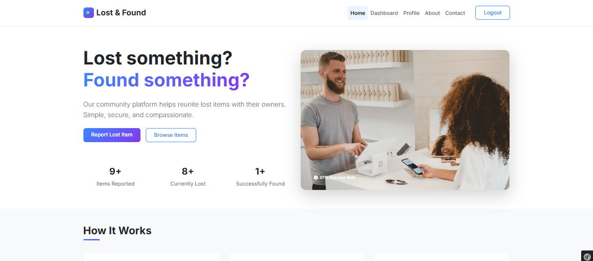
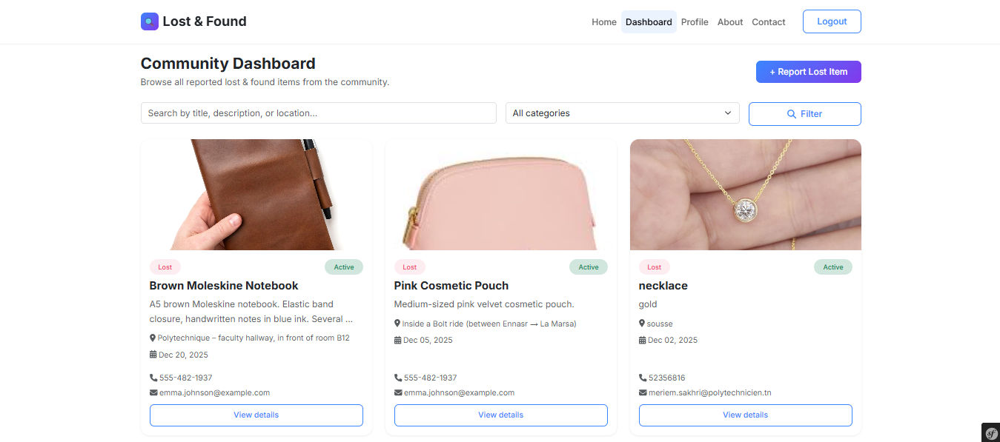
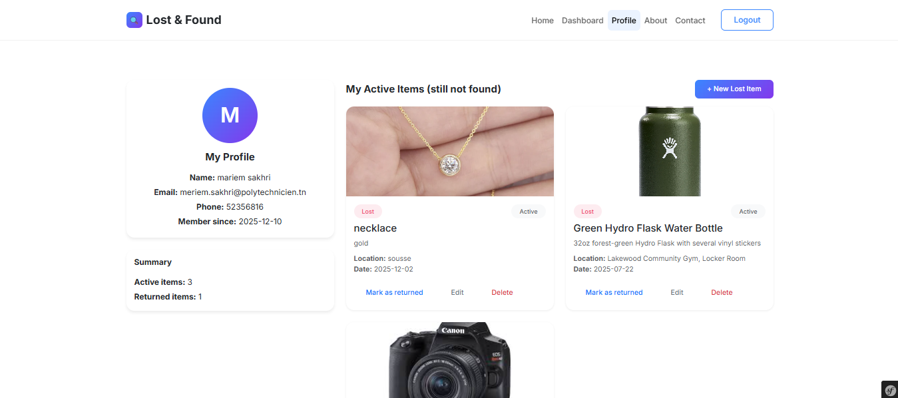

# 🧭 Lost & Found – Symfony Web Application

A community-based web platform built with **Symfony** that helps people report lost items, find belongings, and reconnect with their owners.

---

## 🚀 Features

- User registration & authentication
- Dashboard displaying all active lost items
- Post lost items with images and contact details
- User profile with personal listings
- Mark items as **returned** or **reopen** them
- Edit or delete own posts
- Search and filter items by keyword and category
- Responsive modern UI using Bootstrap
- Secure access control (users can manage only their own items)

---

## 🛠️ Tech Stack

- **Backend:** PHP 8+, Symfony 6
- **Frontend:** Twig, Bootstrap 5
- **Database:** SQLite (Doctrine ORM)
- **Authentication:** Symfony Security
- **Version Control:** Git & GitHub

---

## 🧱 Architecture

This project follows the **Symfony MVC architecture**:

- **Entities:** Define database tables (User, Item)
- **Repositories:** Handle database queries
- **Controllers:** Business logic and routing
- **Templates:** UI rendering with Twig

---

## 📸 Screenshots

### 🏠 Home Page


### 📊 Dashboard


### 👤 Profile Page


---

## ⚙️ Installation & Setup

### 🔧 Requirements

Make sure you have the following installed:

- PHP **8.0 or higher**
- Composer
- Git
- Symfony CLI *(optional but recommended)*

---

### 1️⃣ Clone the repository

```bash
git clone https://github.com/meriemsakhri/lost-and-found-symfony.git
cd lost-and-found-symfony
```
### 2️⃣ Install dependencies

```bash
composer install
```
### 3️⃣ Environment configuration

```bash
cp .env .env.local
```
ℹ️ This project uses SQLite, so no database credentials are required.

### 4️⃣ Create the database

```bash
php bin/console doctrine:database:create
```
### 5️⃣ Create database tables (run migrations)
```bash
php bin/console doctrine:migrations:migrate
```
### 6️⃣ Start the server
```bash
symfony server:start
```
## 🔐 Access Rules

- **Home page:** Public
- **Dashboard:** Logged-in users only
- **Post item:** Logged-in users only
- **Profile page:** Logged-in users only
- Users can only **edit, delete, or manage their own items**

---

## 👤 User Workflow

1. Register an account
2. Log in
3. Access the dashboard
4. Post a lost item
5. Manage items from the profile page
6. Mark items as returned or reopen them

---

## 🎓 Academic Context

This project demonstrates:

- Symfony MVC architecture
- Secure authentication and authorization
- CRUD operations using Doctrine ORM
- Real-world web application workflow
- Clean separation of backend logic and frontend views
